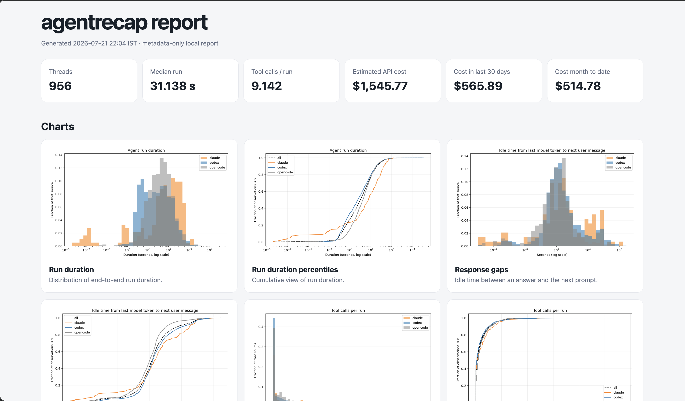

# agentrecap

> Get deeper insights into your local coding agents beyond cost.



Generate a local, metadata-only HTML report from your Codex, Claude Code, and OpenCode sessions.

```bash
uvx agentrecap
# or 
npx agentrecap
# or
pnpx agentrecap
# or
bunx agentrecap
```

If you do not have `uvx` or `pipx` installed, clone the repository and run it with Python:

```bash
git clone https://github.com/bansalarnav/agentrecap.git
cd agentrecap
python3 -m venv .venv && .venv/bin/pip install .
.venv/bin/python -m agentrecap.cli
```

The local virtual environment keeps `agentrecap` and its dependencies separate from your existing Python installation.

## Overview

`agentrecap` only reads your session data and writes its report to a separate output directory. It will not modify your existing environment or any existing session data.

By default, `agentrecap` reads active and archived sessions from `~/.codex`, Claude Code sessions from `~/.claude/projects`, and OpenCode sessions from `~/.local/share/opencode`, then writes the report to `~/.agentrecap/reports/<timestamp>/index.html`. When it finishes, it asks whether you want to open the report in your browser. Use `--open` to open it immediately without the prompt.

```bash
agentrecap \
  --codex-input /path/to/codex/home \
  --claude-input /path/to/claude/projects \
  --opencode-input /path/to/opencode/data \
  --since 2026-01-01 \
  --until 2026-06-30 \
  --output-dir /path/to/report \
  --title "My agent usage report"
```

Use `--since` and `--until` to limit the analysis by local calendar date. Both dates are inclusive, and either flag can be used on its own. Omit both flags to analyze all available sessions.

The report includes:

- Headline recent, month-to-date, and all-time estimated API costs alongside usage metrics.
- Codex, Claude, and OpenCode comparisons.
- Model usage, cache ratios, reasoning-token metrics, and monthly estimated API costs.
- Run-duration, response-gap, thread-length, token, cache, and tool-call charts.
- Human-readable, metadata-only CSV files under the report's `data/` directory.

The generated report does not include transcript contents, only metadata. Thread, run, event, agent, and tool-call identifiers are hashed before they are written.


## Cost estimates

For cost estimation, `agentrecap` uses the pricing catalog from [models.dev](https://models.dev).

Every request is priced before model and month totals are aggregated. Estimates distinguish uncached input, cache reads, five-minute cache writes, one-hour cache writes, unclassified cache creation, output, and separately priced reasoning when available. Generic models.dev context tiers are selected from each request's complete input footprint, so model-specific 200K, 256K, 272K, and future thresholds can be honored. A bounded fallback supplies the former Anthropic long-context rates for logged Sonnet 4 and 4.5 calls over 200K before Anthropic retired that 1M-context beta on April 30, 2026.

Explicit historical `fast`/priority metadata uses the provider's fast-mode price from models.dev; `default` is treated as standard. When a historical record has no speed metadata, it remains `unknown` and is estimated at the standard API rate as a clearly marked fallback—today's local configuration is never applied retroactively. Claude's raw top-level `costUSD`, when present, is retained only as `reported_cost_usd` provenance. All report cards, tables, monthly totals, and displayed exports use the independently calculated `estimated_cost_usd`.

These are API-equivalent token estimates, not ChatGPT, Codex, Claude, or Claude Code subscription spend or credit consumption. They do not include negotiated discounts, batch pricing, or provider/platform charges not represented in the logs. Unknown model IDs and fast modes without an explicit catalog price remain unpriced rather than receiving a guessed rate.

## Development

The project requires Python 3.10 or newer and uses [uv](https://docs.astral.sh/uv/) for dependency and environment management.

```bash
uv sync
uv run agentrecap --help
```

To generate a report from local session data while developing:

```bash
uv run agentrecap --output-dir ./report
```


Build the source distribution and wheel with:

```bash
uv build
```
